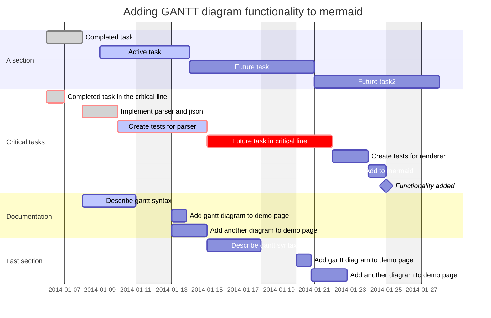

## DROID

D.R.O.I.D. Ops Narrative project

## SPACE

The future goal of the D.R.O.I.D. Ops Narrative project is to submit a scientific publication. The publication will aim to showcase the project's effectiveness and impact on improving literacy and training skills for individuals across various industries and sectors. The scientific publication will also highlight the project's customizable solutions, adaptability to different contexts and user needs, and the quick and effective solutions it provides.

The publication will include case studies and testimonials from individuals and companies that have benefited from the project's training and development programs. It will also incorporate data and statistics on the project's success rates, the number of individuals trained, and the industries and sectors it has impacted.

The publication will be submitted to reputable scientific journals and publications in the field of education and training to ensure its credibility and reach a wider audience. The project team will also promote the publication through various channels, including social media, conferences, and workshops, to raise awareness and encourage more individuals and companies to take advantage of the project's offerings.

Overall, the D.R.O.I.D. Ops Narrative project's future goal of submitting a scientific publication demonstrates its commitment to continuous improvement and showcasing its value to the education and training industry. By sharing its successes and impact, the project can inspire other initiatives and programs to adopt similar approaches and contribute to the overall improvement of literacy and training skills in different industries and sectors.

## TRACK

A roadmap that outlines the steps needed to achieve the project's future goal of submitting a scientific publication.

Step 1: Create Processes for Each Letter of D.R.O.I.D.

* Create at least 4-5 step processes for each letter of the D.R.O.I.D. acronym to provide a framework for the project's training and development programs.

Step 2: Compile Data and Case Studies

* Collect data and statistics on the project's success rates, the number of individuals trained, and the industries and sectors it has impacted.
* Gather case studies and testimonials from individuals and companies that have benefited from the project's training and development programs.

Step 3: Write the Scientific Publication

* Write the scientific publication, highlighting the project's effectiveness and impact on improving literacy and training skills for individuals across various industries and sectors.
* Include the project's customizable solutions, adaptability to different contexts and user needs, and the quick and effective solutions it provides.
* Ensure the publication is credible and reaches a wider audience by submitting it to reputable scientific journals and publications in the field of education and training.

Step 4: Promote the Publication

* Promote the publication through various channels, including social media, conferences, and workshops, to raise awareness and encourage more individuals and companies to take advantage of the project's offerings.
* Continue to showcase the project's value to the education and training industry by sharing its successes and impact.

Step 5: Continuous Improvement

* Continue to improve the project by incorporating feedback from individuals and companies that have benefited from the project's training and development programs.
* Explore new ways to adapt the project to different contexts and user needs.
* Consider expanding the project's offerings to reach a wider audience and impact more industries and sectors.

